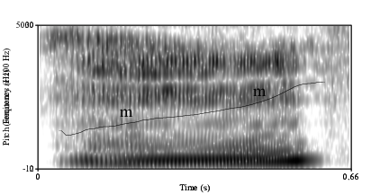

#  Syllable structure
The syllable structure appears to be

- \(C)(L)V(ː)(N)

L stands for /l/, /r/, or /w/ (if /w/ is to be analyzed as a separate segment here). N stands for a nasal.

## Nucleus

The nucleus consists of one vowel, which can be short or long. Complex nuclei have not been attested yet.
<!-- check sia `sweat' -->

- *m**i*** ‘go’
- *k**oo**l**ɛ**ng* ‘forest’

The nucleus may equally consist of a nasal.

- *m* `five'

## Onset

Most words have an onset. Attested words without an onset are

\ea
\ea *arapo* `tobacco (powder)'
\ex *oloa* `rubber'
\z
\z

The onset normally consists of one consonant. All nasals can occur in the onset (*nga* `tomorrow', *nyoswa* `God'). Complex onsets do exist. The second consonant is /l/ or /r/ in these cases. Depending on analysis, *pw*, *gw*, and *hw* could be seen as a simple onset consisting of one complex segments or as a complex onset consisting of two segments.

Attested words with complex onsets are

- ***kl**i* `strength'
- ***kr**a* `now`
- ***hr**ɛŋ*
- ***chr**ɔ*  `butterfly'
- ***sr**ɛ* `braids'%nattes

- ***pw**ɛ* `legs'
- ***djw**ɛ* `'
- ***gw**ɛ* `chimp'
- ***kw**e* `banana'
- ***kw**ɛŋ `dead'
- ***hw**oŋ* `here'

## Coda

The nucleus can optionally be followed by a nasal or a glottal. The nature of the glottal needs further investigation. It is provisionally rendered as h.

- *hwo**ŋ*** `here'
- *po**h*** `leg'

